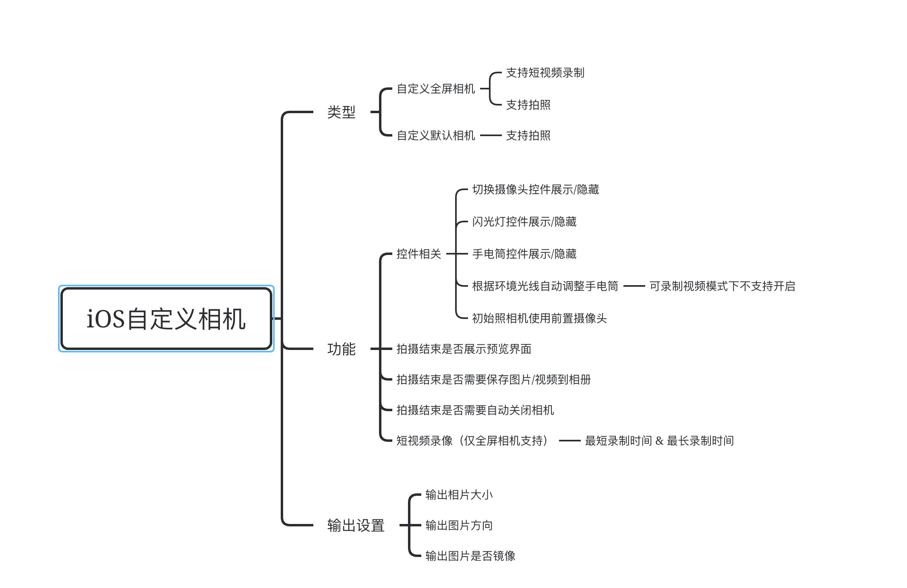

# LLZCamera

 iOS端自定义相机组件

 封装iOS底层库AVFoundation，生成自定义相机组件，支持短视频拍摄、照片拍摄、自动光线识别、闪光灯/手电筒、添加相机蒙层等功能。

 

 ## 接入
 参考[接入文档](./相机组件接入说明.pdf) 
 
 
 ## 参考
[官方文档](https://developer.apple.com/library/archive/documentation/AudioVideo/Conceptual/AVFoundationPG/Articles/04_MediaCapture.html#//apple_ref/doc/uid/TP40010188-CH5-SW2)

[iOS自定义相机 组件水印](https://www.cxyzjd.com/article/qq_34047841/73550986)

[iOS自定义相机：带拍摄区域边框、半透明遮罩层、点击屏幕对焦、自动裁剪](https://cloud.tencent.com/developer/article/1842294)

[自定义相机 滤镜](https://juejin.cn/post/6844903854006337550)

[iOS 相机前置闪光设置AVCaptureFlashModeAuto不生效](https://www.jianshu.com/p/8a19e167a7bb)

[iOS tips](https://github.com/wsl2ls/iOS_Tips)

[相机使用blog](https://xiaovv.me/2017/09/20/Use-UIImagePickerController-in-iOS/)

[AVFoundation 初探](https://juejin.cn/post/6844904102950862856#heading-10)

[相机接入详解](https://www.jianshu.com/p/8c7ca1dd7f02)

